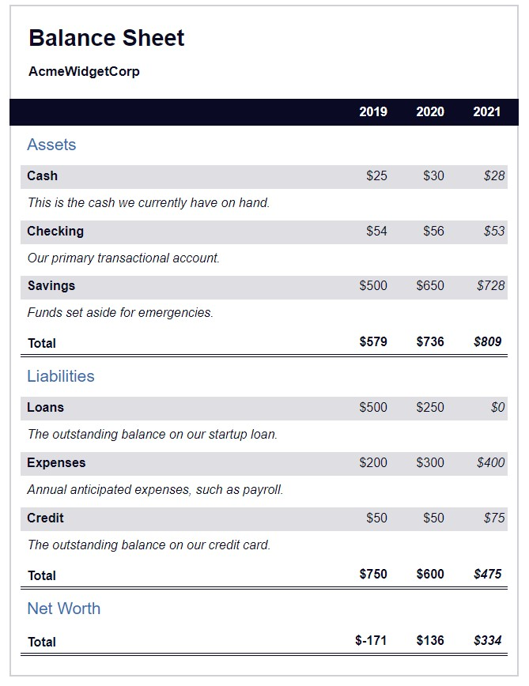

# BALANCE SHEET

## 1. Description
freeCodeCamp HTML & CSS balance sheet project.

DEPLOYMENT:
 [DIRECT LINK](https://cbushehry.github.io/balance-sheet/) | [GITHUB REPOSITORY](https://github.com/cbushehry/balance-sheet)

## 2. Features
 * Review the codebase to see how to build your own balance sheet with HTML and CSS.
  
 

## 3. Credits / Contact
This application was created by Cameron Bushehry

  
  